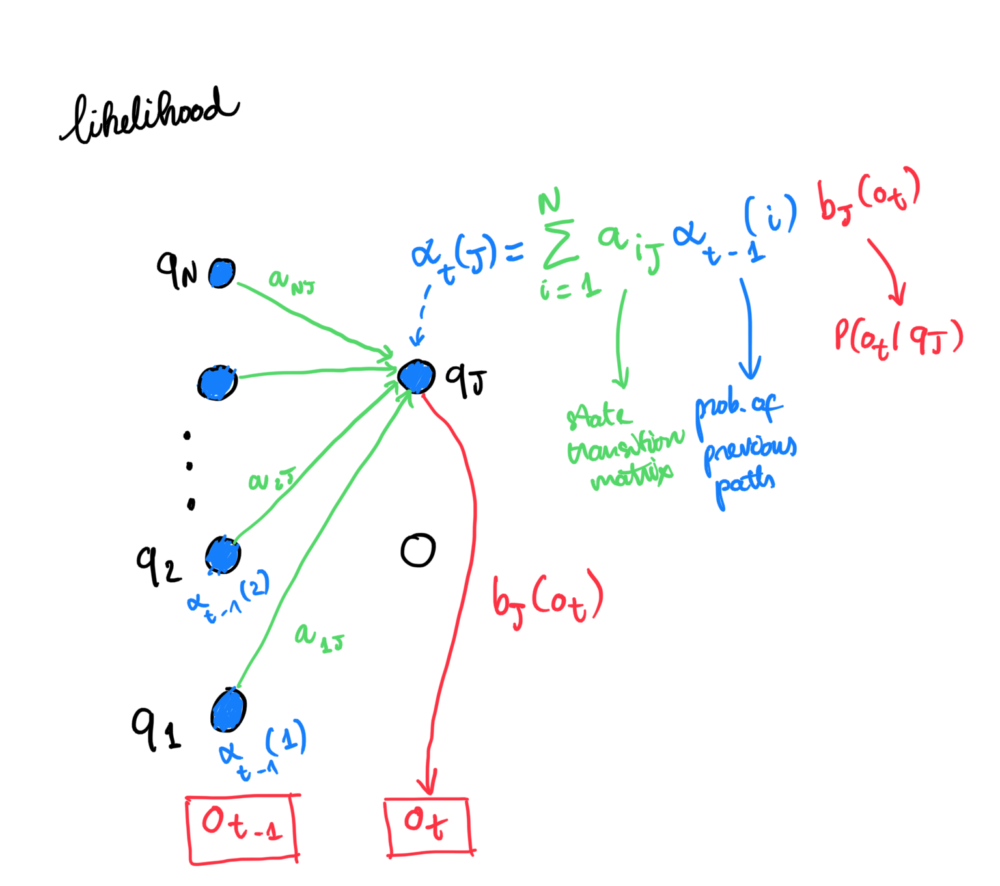

# Hidden Markov Model
## TL;DR
Hidden Markov Model (HMM) is
 - A probabilistic sequence model, augmenting [[Markov Chain]], where the **actual state is unknown**
 - Has three characteristics:
	 - Likelihood (Similar with [[Language Model]])
	 - Decoding (Discover best hidden state)
	 - Learning (or training)
  - Applications: Sequence Labeling problems: [[Named Entity Recognition]], [[Automatic Speech Recognition]], ...
  
## Definition
  - Beside states $Q$, state-transition matrix $A$ and initial probability distribution $\pi$, HMM extends Markov chain with:
	  - $O$ **Observations** - Only information of current state that we know
	  - $B = b_i(o_t)$ The **observation likelihood**, or **emission probability**, $P(o_t|b_i)$ probability of an observation $o_t$ that was generated by state $q_i$
  - In other words, HMM parameters are $A$ - state transition matrix and $B$ - observation likelihood
  - Assumptions for first-order HMM:
	  - Markov assumption
	  - Output independence: Probability of an ouput observation $o_i$ **only depends** on the state $q_i$
 
### Likelihood Estimation
Given a HMM $\lambda$, and a sequence of observation $O$, find likelihood of that sequence

For **N** hidden states and **T** observations, we can try to calculate all $N^T$ possible sequences of state that can induce $O$, then sum all the probability to get the likelihood of that sequence - very inefficient

Another approach (which is more doable) is using **forward algorithm** with complexity $O(N^2T)$. 

## References
1. Hidden Markov Model [slp3 - Appendix A](https://web.stanford.edu/~jurafsky/slp3/A.pdf)
